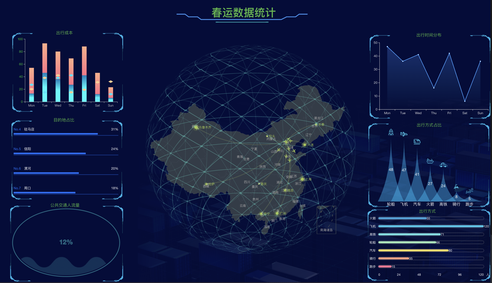
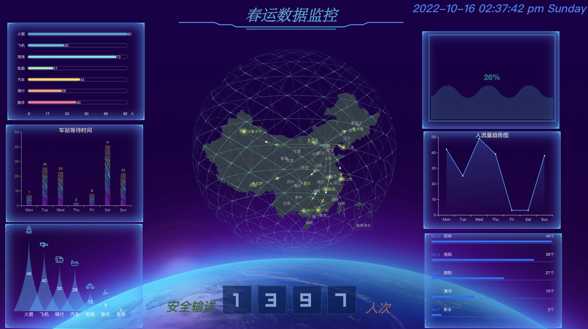
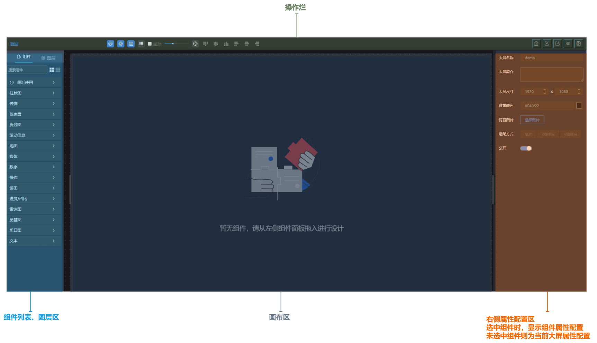
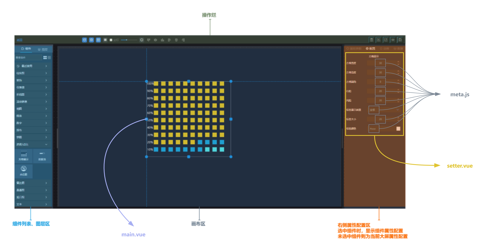

# vue2-big-screen

> 基于 vue2 进行搭建的大屏设计器项目，实现通过简单的拖拉拽即可快速配置大屏页面，后续会陆续推出 vue3 版本 、react 版本等




## Features

- [x] 拖拽配置
- [x] 支持静态数据
- [x] 支持接口数据
- [ ] 支持 sql 语句查询
- [x] 支持加密/公开
- [x] 支持背景图选择
- [x] 丰富的图片素材库
- [x] 预览

## [Live Demo](https://www.bs.543.zone/)

## get started

```
npm install
```

### Compiles and hot-reloads for development

```
npm run serve
```

### Compiles and minifies for production

```
npm run build
```

## component development

1. 增加配置文件
   增加配置文件后，运行时会自动读取相关文件生成大屏组件列表，无需额外配置注册，文件分别是：

- meta.js：组件的元信息文件，包括分组、标题、默认数据等
- main.vue：组件的 UI 文件，为最终呈现方式
- setter.vue：组件属性设置器文件，对组件的各项属性进行配置
  
  

1. 数据获取
   通过调用大屏工具方法并传入当前组件的数据配置(如请求地址、是否轮询、轮询间隔等)来实现数据获取

```js
import { getDataJson, pollingRefresh } from '@/utils/big-screen'
import { v1 as uuidv1 } from 'uuid'
export default {
  props: {
    // 当前组件的配置属性
    configProps: Object
  },

  created() {
    this.uuid = uuidv1()
  },

  mounted() {
    // 刷新数据
    this.refreshCptData()
  },
  methods: {
    refreshCptData() {
      // 刷新数据，传输当前数据配置，内部会根据具体属性进行操作，如是否轮询、加载数据等
      pollingRefresh(this.uuid, this.configProps.cptDataForm, this.loadData)
    },
    loadData() {
      getDataJson(this.configProps.cptDataForm, this.cptId).then(res => {
        // res 为当前数据，可以进行渲染操作
      })
    }
  }
}
```

## todolist

1. 更改组件通信方式，通过状态管理进行通信，避免产生不必要的调试成本，维持单项数据流
2. 组件事件的统一管理，目前组件事件的触发和处理都是在组件内部进行，后续会统一管理
3. 数据下钻功能，实现多维度数据展示
4. 数据联动功能，实现多组件联动
5. 全局变量功能，形成通用数据的公共变量池，实现数据共享
6. 外链分享功能，实现大屏的分享及发布
7. tab 页功能，丰富大屏的展示形式及内容
8. 数据监控功能，实现数据的实时监控及预警
9. 移动端布局适配工作
10. 插件化功能，实现大屏的插件化，如地图、图表及其他组件的插件注入功能
